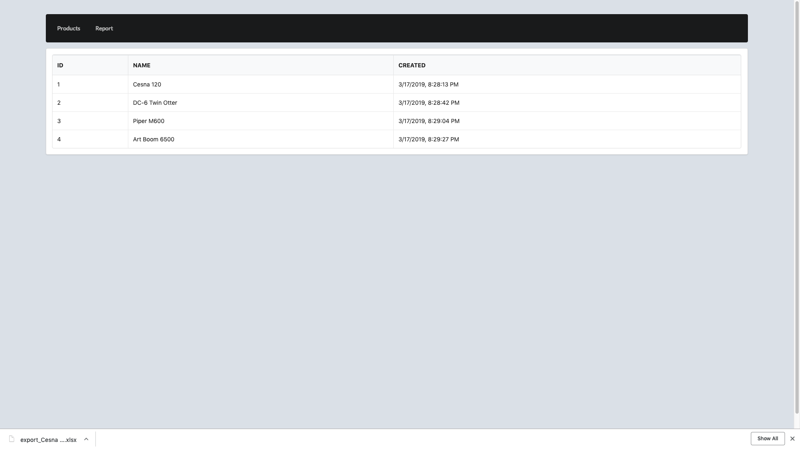
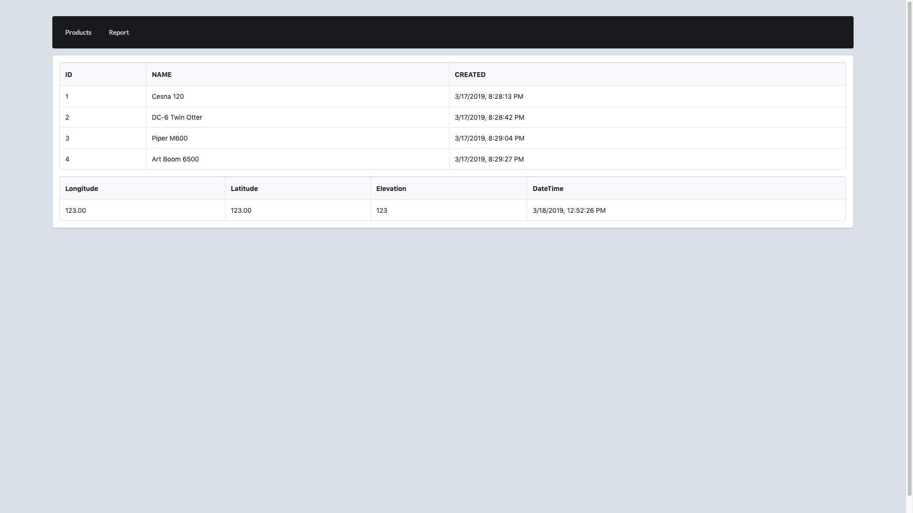
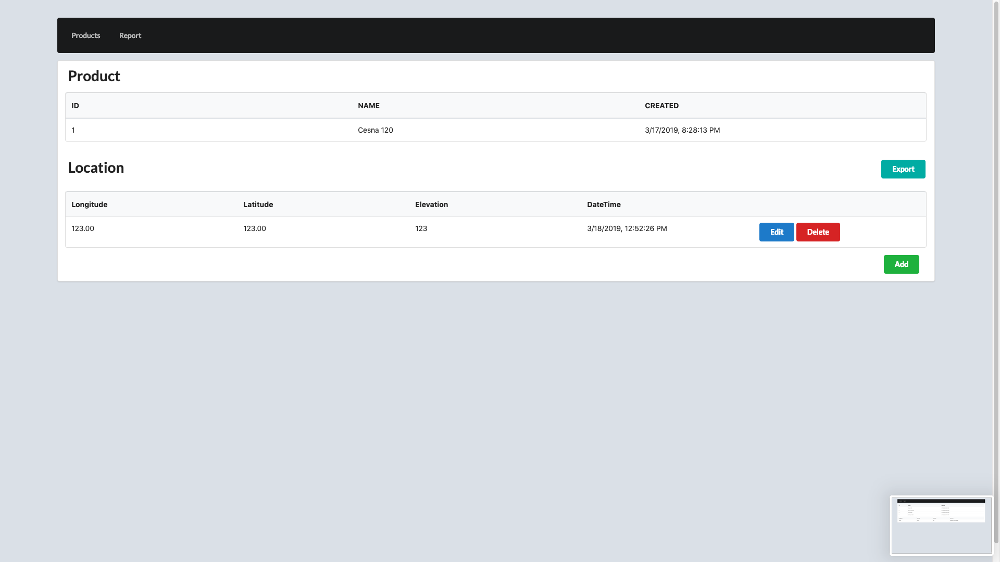
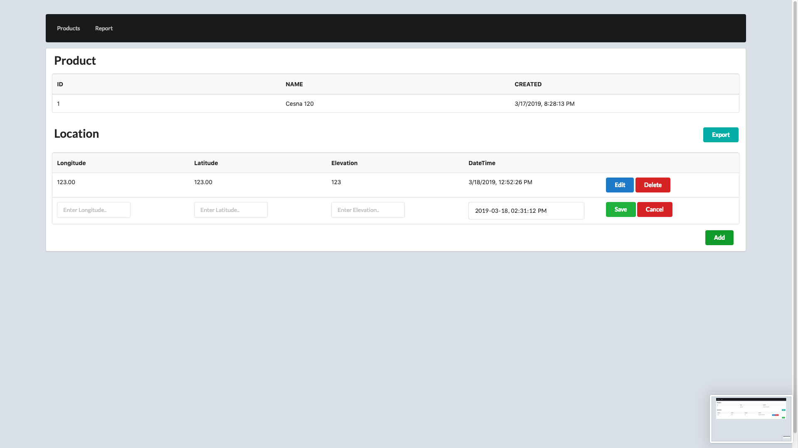
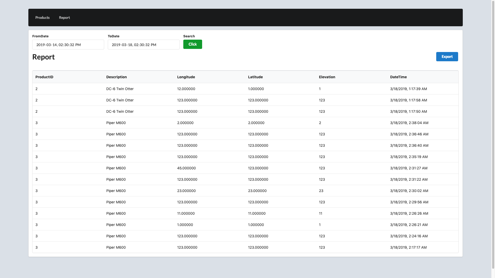

# ScreenShot

## Product view 1

## Product view2 - When a user click the product.

## Product Detail view 1 - When a user double-click the product product view

## Product Detail view 2 - When a user click the Add button

## Report view - When a user set the date range and click search 

